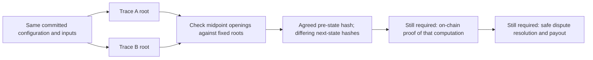

# Action enforcement: next boundary after bond liveness

> Research record. The approved product model is now [cooperative payouts with
> independent owner refunds](payment-model.md). Enforced winnings against a
> refusing signer and on-chain gameplay verification are not release requirements.

## Why change direction?

The [Poker audit](poker-exit-audit.md) and [minimal ladder repair](poker-ladder-repair.md)
show that keeping a bond locked does not make its owner sign a payout. The
existing on-chain take-game experiment enforces legal actions and timeouts for
its tiny rules, but does not verify StakeWars physics or make an off-chain game
history irreversible. Extending liveness penalties does not fill those gaps.

A more relevant research direction is **disputing computation**, with a way to
resolve silence. A participant who answers must supply a valid next proof step,
not simply demonstrate that it still controls a key.

## New executable result: actual simulation traces

`research/turntrace` runs StakeWars' actual deterministic simulation on checked-in
two- and six-player replay fixtures. It commits indexed state hashes to a Merkle
root, then authenticates midpoint openings until differing final results are
reduced to one adjacent-state disagreement.

For a 512-tick real simulation prefix, narrowing takes nine midpoint rounds.
For a synthetic 20,000-tick trace it takes 15. Tampered openings/paths, different input
contexts and changed lengths are rejected. Tests also allow traces to diverge
and rejoin, avoiding an incorrect monotonic-divergence assumption.

**This is not a nine- or fifteen-transaction settlement claim.** Each round
involves two authenticated openings. Transaction packaging, authorization,
deadlines, multiple challengers and the terminal proof are not implemented.

## The measured obstacle

The maximum serialized states in the tested prefixes are 148,032 bytes for the
duel and 394,452 bytes for the wide six-player map. A whole-state submission is
therefore not a practical one-transaction check under the audited stock node's
100,000-byte transaction limit, let alone the script stack-element limits.

Merkle commitments let a verifier request selected memory cells without sending
the entire map. The earlier `research/settlement/memoryproof` experiment checks
one fixed memory-read-plus-add fraud proof under existing Script. It does **not**
yet authenticate or execute the instructions that implement a StakeWars tick.
A single tick can include terrain, projectile, collision and damage work, so
"one disputed tick" is not necessarily a small on-chain computation.

A possible next decomposition is tick -> committed instruction trace -> one
instruction plus memory proofs. That needs a specified deterministic execution
machine, a committed program/version, canonical state encoding, proof of every
instruction's allowed behavior, and an exact accounting of transaction sizes and
fees. No claim of practical implementation or a transaction bound is made yet.

## Requirements for a real protocol

| Requirement | What must be enforced | Current status |
|---|---|---|
| Authoritative action | Actor, turn, game context, permitted action and availability | Local signed turn replay exists; accepted history is not yet enforced on-chain |
| Irreversible progress | An actor cannot replace an earlier accepted losing move | Existing toy test still demonstrates rollback before confirmation |
| Meaningful response | A valid proof/action advances a fixed dispute; a heartbeat does not | Merkle openings authenticated locally; no on-chain dispute contract |
| Timeout | Missing required proof has an agreed, enforceable consequence | CSV primitives tested; this protocol's consequence is not defined |
| Correct result | Terminal verifier establishes the allowed successor state | Actual simulation runs locally; full Script verifier absent |
| Multi-party safety | Five colluders cannot suppress the honest challenge or exhaust it | Unresolved; a two-party demonstration would not establish it |
| Recoverability | Data, saved commitments, deadlines and fees survive interruption | No integrated recovery lifecycle |

In particular, losing a proof deadline cannot blindly pay whoever accused first.
An honest player must not be forced to answer unlimited bogus claims, and a
colluding claimant/challenger pair must not exclude the honest participant.
Input disclosure and challenge access must be settled before a fallback can
safely control the pot.

## Decision and next concrete test

Keep these experiments isolated from payments. The next useful test is a
**single real simulation operation** expressed in a verifiable execution model,
with its actual state/memory witness and script budget. If that cannot be checked
within practical limits, reject or revise the design before implementing a
whole dispute protocol. Separately, an agreed move history still needs an
on-chain finality mechanism; fast local replay alone cannot provide one.

Run `make turntrace-check` and `make turntrace-demo`. The report and source make
all missing steps explicit; no production hash format, game rule, funding gate
or trust assumption was changed.

## First real arithmetic operation tested

The [bazooka gravity proof](../research/flightproof/README.md) now compares a
Script fraud predicate against `sim.Step` for 45 bounded velocity inputs. Correct
results cannot trigger that branch; results differing by one raw fixed-point
unit can. The representative transaction is **517 bytes**, its redeem script
uses **44 operations**, and stock mempool admission passes.

This is one operation, not one complete tick. Its scalar input commitment is
not yet linked to canonical game-state memory, and the weapon/fuse/control-flow
preconditions are not yet established by Script. The next binding work is to
prove both the input's origin and why this operation is the authorized next step,
then authenticate its output in the successor state. No production code changed.
