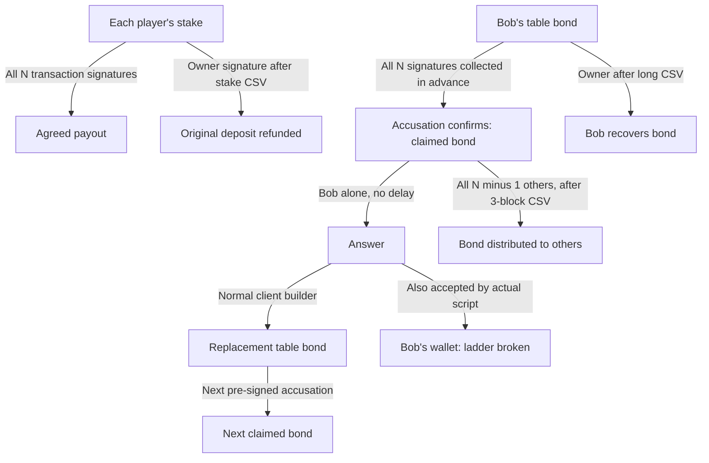

# Poker ladder: what happens when the loser refuses?

> Research record. The approved product model is now [cooperative payouts with
> independent owner refunds](payment-model.md). Enforced winnings against a
> refusing signer and on-chain gameplay verification are not release requirements.

Audited 2026-09-16 against clean local dcrpoker commit
`4d8569f5cc76308678192f6a70a10d53f0914a9e`.

**Result: the existing ladder is a bond-liveness mechanism, not an enforced
winner-payout mechanism. It does not meet StakeWars' one-honest-player guarantee.**
There is also an executable counterexample: the accused owner can answer into
an ordinary wallet output, escaping the remaining pre-signed ladder.

## Exact spending paths



- **Stake:** N-of-N settlement, or depositor-only refund after the agreed relative
  timelock. Not N-minus-1. Source: [RedeemScript](../../dcrpoker/pkg/escrow/script.go).
- **Table bond:** N-of-N cooperative release or pre-signed accusation; owner-only
  backstop after 2,016 blocks. Source: [TableBondScript](../../dcrpoker/pkg/escrow/liveness.go)
  and [membership terms](../../dcrpoker/pkg/membership/roster.go).
- **Claimed bond:** owner alone immediately; otherwise **all** other members
  after three blocks measured from accusation confirmation. No winner proof is
  checked. Source: [ClaimedBondScript](../../dcrpoker/pkg/escrow/claimed.go).
- **Ladder:** up to eight pre-signed accusations. Each next rung spends the exact
  output of the *expected* answer transaction. Stable transaction IDs permit
  constructing these before witnesses exist. Source: [BuildAccuseChain](../../dcrpoker/pkg/escrow/claimchain.go).

## Alice wins; Bob refuses

Fixture: each player stakes 1 DCR; Bob's separate table bond is 0.01 DCR.
Amounts below exclude Alice's own bond and registration bond. A refused payout
is not a partially spendable transaction: every input requires every member.

| Situation | Alice can obtain | Transactions and waiting |
|---|---|---|
| Alice already holds the fully signed winning transaction | Heads-up pot less settlement fee: 1.9998 DCR | One settlement transaction; no script delay, while inputs remain unspent |
| Bob never supplied his payout signatures | Alice's original stake less refund fee: 0.9998 DCR | One owner refund after configured stake CSV; **no winnings** |
| Bob also ignores a fully pre-signed bond accusation, heads-up | Bob's bond less two claim fees: 0.0098 DCR | Accusation + take: two transactions; take eligible at claimed-output age 3 |
| Bob refuses payout but answers on-chain | Bob can reclaim his bond into his wallet | Accusation + redirected answer: two transactions; answer branch has no CSV |
| Six players; Bob disappears and all five others cooperate | Each other player receives 0.00196 DCR from Bob's bond | Two transactions, five take signatures, three-block claimed-output CSV |
| Six players; Bob and another participant refuse | Alice cannot collect Bob's bond alone | Four available take signatures are insufficient; her own stake refund remains available |

Thus even in the favorable heads-up silent-loser case, Alice's stake refund plus
Bob's bond yields **1.0096 DCR**, not the 1.9998 DCR winning payout. A larger bond
would change that arithmetic, but would not fix the owner-redirection or multiple
refuser cases.

The fixture's stake CSV is 64 blocks, taken from Poker's escrow test setup,
**not a proposed StakeWars default**. Real stake CSV comes from the table terms.
At Decred's five-minute target, 3/64/2,016 blocks are approximately
15 minutes / 5h20m / 7 days; actual inclusion and block times are variable.
Relative delays begin at the corresponding output's confirmation, not when a
player disappears. At maturity, conflicting refunds or bond takes can race a
cooperative settlement or late answer; there is no guaranteed priority.

## Confirmed gaps

### Answering does not enforce re-bonding

`BuildAnswer` normally pays the original bond script. However, the claimed-bond
answer branch checks only Bob's signature. A hostile Bob changes the destination
before signing. The resulting transaction passes both the real script engine
and stock mempool admission. Its output has a different transaction ID, so the
next pre-signed accusation cannot spend it. No gameplay participation or payout
signature is required to make that answer.

This is a passing **counterexample test**, not a fix. Merely changing the client
builder or requiring it to check its own output cannot constrain a hostile client.

### A signed game checkpoint is not a signed settlement transaction

[Driver checkpoints](../../dcrpoker/pkg/driver/table.go) authenticate log state.
[The plugin](../../dcrpoker/cmd/pokerplugin/settle.go) separately builds and signs
a spending transaction when the table is over. A complete log checkpoint does
not supply the missing transaction signatures. The audited code does not
pre-sign every possible final StakeWars winner payout.

If multiple different payouts over the same deposits *have* been fully signed,
the escrow script does not revoke the older one. The test confirms both payout
versions remain script-valid. Confirmation/conflicting spends choose which can
actually execute. Updating a local record is not on-chain revocation.

### Setup and fee handling also need work

The plugin's `presignAccusations` explicitly does not gate dealing. A player can
stop before its accusation set is complete. No accusation can be broadcast
without the required prior signatures. This audit tests the stronger scenario
where the first accusation was completely signed during setup.

Current plugin constants are 10,000 atoms per claim transaction and 20,000 for
settlement/default refund. Tests use those amounts. The six-player winner-only
settlement measures **4,377 bytes**: at the audited dcrd default relay rate of
10,000 atoms/kB it needs at least **43,770 atoms**, exceeding the fixed 20,000.
The settlement test establishes script validity, not its mempool acceptance.
Fees must be sized before gathering signatures. Repricing a pre-signed parent
also changes the outpoints used by descendants.

With compliant answers, consuming all eight accusation/answer rounds would be
16 transactions and 160,000 atoms in current claim fees for that bond. The
hostile owner need not follow those rounds: it can exit at the first answer.

## Practical decision for StakeWars

Do not port this ladder as a guarantee that winners are paid. Its reusable parts
are deterministic drafts, N-of-N cooperative signing, owner refunds, persistent
pre-signed transactions and chain-based deadlines.

A refund-backed mode could honestly promise **cooperative payouts and unilateral
recovery of original deposits**. It would permit a loser to veto winnings, so it
is not the requested trustless real-money game and is not enabled by this audit.

For the requested guarantee, the next design must pass these concrete cases
before SDK integration:

1. Alice wins and Bob never signs the final payout: Alice still receives the
   correct winnings through a bounded recovery path.
2. Bob answers every liveness challenge but refuses the payout: same result.
3. One honest player faces five colluders: they cannot take its funds, veto its
   rightful payout, or exhaust its recovery budget through repeated claims.
4. Old states, missing setup signatures, unavailable game data, fee changes and
   expiry of refund windows have explicit safe outcomes.

Keeping the current trust assumptions requires an enforceable game-result or
state-transition mechanism; this ladder does not provide one. Introducing a
referee or participant quorum would change those assumptions and cannot be
silently substituted. There is no validated low-transaction-count design yet.

## Reproduce

```sh
make poker-exit-check
```

[Tests and runner](../research/settlement/pokerexit/) use Go source overlays to
execute the **actual Poker builders and scripts**, without editing Poker or dcrd.
They test two and six players, missing signatures, original-stake refund,
conflicting fully signed payouts, bond collection, a second refuser, and the
redirected-answer attack. Contextual dcrd tests reject refund at age 63 and accept
at 64, reject bond take at age 2 and accept at 3, and accept redirected answers
at age 1. Funding amounts are independently specified in the node harness.
All UTXOs/keys are synthetic; no wallet, bridge, broadcast or live funds are used.

## Follow-up: bounded repair experiment

A [pre-signed-answer variant](poker-ladder-repair.md) prevents the owner-output
escape without extra transactions. It requires saved signatures for recovery
and still does not enforce winnings against a responsive but refusing loser.
The original counterexample remains unchanged and passing.
