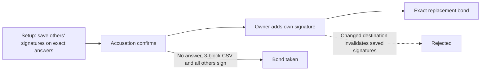

# Minimal ladder repair: pre-signed answers

> Research record. The approved product model is now [cooperative payouts with
> independent owner refunds](payment-model.md). Enforced winnings against a
> refusing signer and on-chain gameplay verification are not release requirements.

Research prototype, 2026-09-16. Implemented only in StakeWars' source-overlay
tests; neither Poker nor the SDK uses this variant.

## Result

The [exit audit](poker-exit-audit.md) showed that Poker's owner-only answer lets
the owner redirect the bond into its wallet. This can be prevented using ordinary
signatures, **without a covenant, a new opcode or an additional transaction**.

Change the claimed-bond answer branch to require every member. Before play,
every other member signs each exact answer paying back into the table bond.
The owner durably stores those signatures. When accused, the owner supplies only
its own new signature, combines it with the saved signatures, and broadcasts.
The other players need not be online or willing at that time.



The revised script is conceptually:

```text
IF
    require signatures from ALL members
ELSE
    require 3-block CSV
    require signatures from ALL members except owner
ENDIF
```

The output constraint comes from the saved SIGHASH_ALL signatures, not from
an on-chain output-checking opcode. A hostile owner cannot redirect while at
least one non-owner refuses to sign a different answer. If all members agree to
a different destination, that remains an authorized cooperative spend.

## Measured tests

| Members | Redeem script | Answer input script | Answer transaction |
|---|---:|---:|---:|
| 2 | 115 bytes | 250 bytes | 357 bytes |
| 6 | 403 bytes | 803 bytes | 912 bytes |

Both answers pass stock dcrd mempool checks at input age one, with the existing
10,000-atom claim fee. Tests execute all eight linked accusation/answer rounds,
reject destination changes even with a fresh valid owner signature, and reject
an answer missing a saved non-owner signature. The unanswered branch still
requires every other member; a second refuser still blocks it.

The experiment uses a 1,000,000-atom bond. Eight accusation/answer rounds consume
16 transactions and 160,000 atoms, leaving 840,000 atoms in the final bond. This
is a worst-case exercised sequence, not an expected normal-game cost.

## Tradeoffs and remaining failures

- **Recovery now requires backups.** The owner seed alone cannot reconstruct
  other participants' signatures. Losing the saved answers can make the owner
  unable to contest an accusation, even though it is online. Restore testing
  and redundant durable storage are funding prerequisites.
- **Setup must finish before risk begins.** Every owner must verify and retain
  the exact answer set before an accusation against its funded bond can be
  exercised. This test models completed setup; it does not implement an atomic
  multi-party funding/signature exchange.
- **Fees and outpoints are fixed in advance.** Repricing a parent invalidates
  descendants. A real implementation needs a deliberate fee reserve and
  recovery policy, not the fixture's hardcoded amounts.
- **A valid answer does not prove game participation.** Bob can give every
  required bond answer while refusing every payout signature. The experiment
  completes all eight rounds without ever obtaining a settlement signature.
- **Exhaustion is not a winner verdict.** After the last answer there is no
  next pre-signed accusation. The owner backstop remains, while stake settlement
  still requires unanimity. Making the last rung automatically pay the accuser
  would let malicious accusers exhaust an honest owner's ladder too.
- **The multi-refuser problem remains.** Requiring all five others at a
  six-player table allows any one of those five to block bond collection.
  Replacing that with majority signatures changes the trust model.

## Decision

This is a small, testable repair to a bond-output escape, but **not the missing
StakeWars settlement solution**. Keep it as a documented candidate, not a
production payment change. Under the requested trust model, a valid recovery
path must depend on the game state or an enforceable game action, rather than
merely the willingness to answer a liveness challenge.

The next investigation should bind a concrete turn/action to its authorized
financial consequence, with explicit timeout behavior. It must handle a player
who answers on-chain but refuses gameplay, and distinguish that case from an
honest player falsely accused by the other five. Repeating liveness accusations
or increasing the bond does not establish that distinction.

## Reproduce

```sh
make poker-exit-check
```

[Repair tests](../research/settlement/pokerexit/testdata/repair_test.go) are
explicitly separate from the unchanged Poker counterexample. All keys/UTXOs are
synthetic; tests use the real script engine and stock contextual mempool harness,
not live-chain broadcasts. No real-money mode is enabled.
